# Teoria dos Grafos

## Oque sao grafos?
Grafos sao modelos matematicos que podem ser usados na resoluçao de um conjunto de problemas
Uma aplicaçao comum e encontrar a distancia entre dois vertices.


## Oque é um grafo?
Um grafo e um modelo matematico que representa relaçoes entre objetos.
Um grafo `G` consiste em um conjunto de vertices (vertexes `V`) ligados por um conjunto de arestas (edges `E`) (`G = (V,E)`).

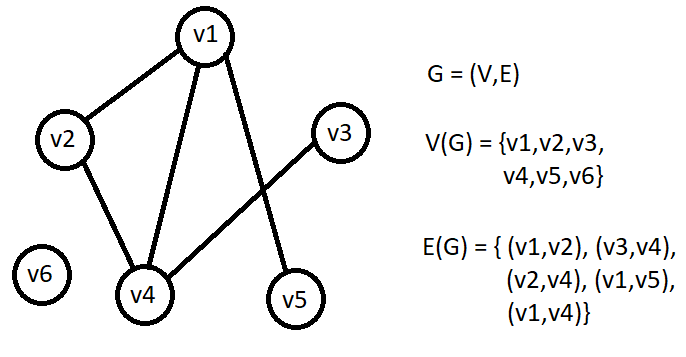


## Ordem de um grafo
A ordem de um grafo e dada pela cardinalidade do conjunto de vertices (`|V(G)|`), ou seja, pelo numero de vertices de `G`.
O numero de arestas e dado pela cardinalidade do conjunto de arestas (`|E(G)|`), ou seja, pelo numero de arestas de `G`.
Considerando o grafo anterior:
`|V(G)| = 6` `|E(G)| = 5`


## Laços 
Se houver uma aresta do grafo `G` que possui o mesmo vertice como extremo, entao o grafo possui um laço.

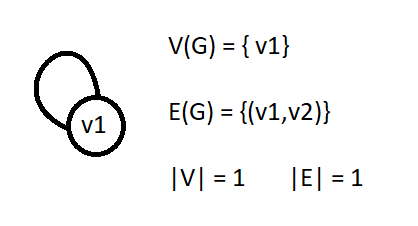


## Grafo simples e multigrafo
Quando um grafo possui mais de uma aresta interligando os mesmos dois vertices (arestas multiplas) ou se este grafo possui um laço (loop) ele é multigrafo.
Grafos simples nao possuem arestas multiplas nem loops.

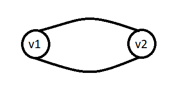


## Grafo Trivial ou Grafo Vazio
E todo grafo de ordem 1.

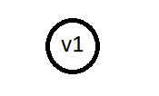


## Vertices Adjacentes
Os vertices `x` e `y` sao adjacentes quando estes forem extremos de uma mesma aresta

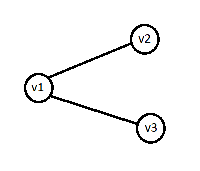

`v1` e adjacente de `v2` e `v3`


## Arestas adjacentes
Duas arestas sao adjacentes quando possuem um mesmo extremo ou vertice

considerando o grafo anterior:
A aresta `(v1,v2)` e adjacente a aresta `(v1,v3)`


## Grau de um vertice
O grau de um vertice `d(v)` corresponde ao numero de arestas incidentes a `v`.

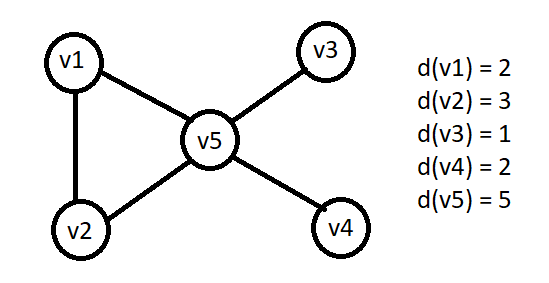

Se o grafo for simples tambem pode se dizer que o grau de um vertice `v` e igual ao numero de adjacentes que ele possui


## Grafo regular 
Um grafo regular e um grafo onde todos os seus vertices possuem o mesmo grau

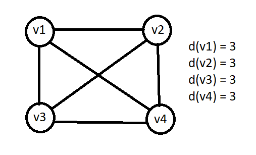

Todos os vertices possuem grau 3


## Grafo completo (`Kn`)
Um grafo e completo se todos os seus vertices forem adjacentes uns dos outros
Um grafo completo `Kn` (com `n` sendo o numero de vertices) possui `n(n-1)/2` arestas


>Atençao: A formula funciona somente para  grafos simples


## Detalhes 
* O grau de um vertice tambem pode ser encontrado como a 'valencia' do vertice

* O grau de um grafo e o maior grau encontrado nos seus vertices

* Um vertice que possui grau 1 e chamado de pendulo

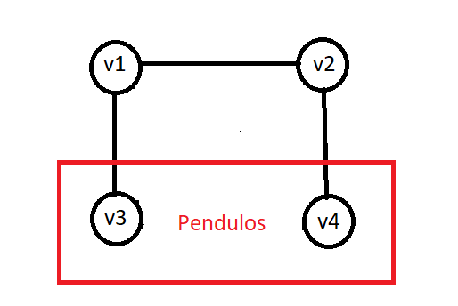


## Grafos orientados (Digrafos)
Consiste em um conjunto de arestas que sao pares ordenados onde o primeiro
valor e a origem e o segundo e o destino. Funciona como se as arestas tivessem uma direçao onde a aresta `(x,y)` vai de `x` para `y`

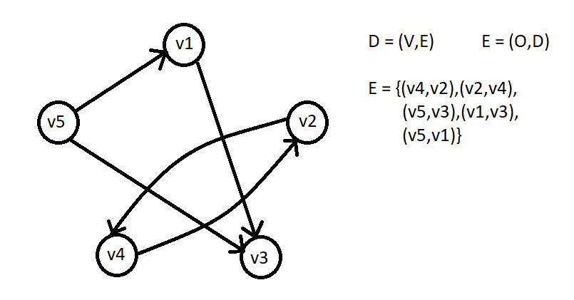

>Atençao: A aresta `(4,2)` e diferente da aresta `(2,4)`


## Convergencia e Divergencia 
Em um grafo orientado cada aresta `e = (x,y)` possui uma unica direçao (de `x` para `y`) logo, `(x,y)` e divergente a `x` e convergente a `y`

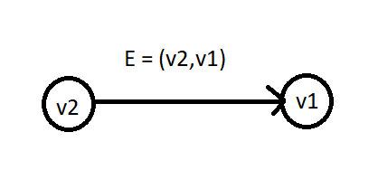

`e=(v2,v1)`

`(v2,v1)` e convergente a `v1` (`v1` e o destino)
`(v2,v1)` e divergente a `v2` (`v2` e a origem)


## Graus em vertices de grafos orientados
Em grafos orientados os vertices possuem graus de entrada (`din(v)`) e graus de saida (`dout(v)`)

`din(v)` - graus das arestas que apontam para este vertice
`dout(v)` - graus das arestas que saem deste vertice

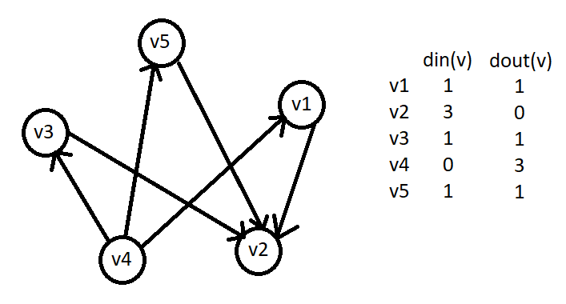


## Verices Fontes e Vertices Sumidouros
* vertices fontes sao vertices que possuem grau de entrada nulo (`din(v) = 0`)
* vertices sumidouros sao vertices que possuem grau de saida nulo (`dout(v) = 0`)

Considerando o grafo anterior:
* `v4` é um vertice fonte pois possui `din(v4) = 0`
* `v2` e um vertice sumidouro pois possui `dout(v2) = 0`


## Caminhos
Caminhos sao conjuntos de arestas e vertices que unem dois vertices `x` e `y`

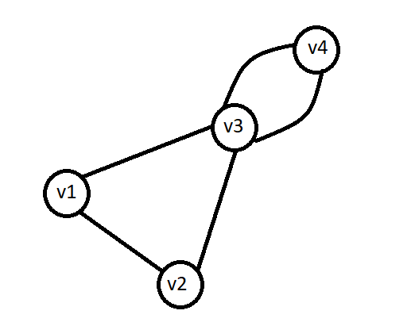

`v1,v2,v3,v4` e um caminho
`v1,v2,v3,v4,v3,v1` tambem e um caminho


## Ciclos
Ciclo e um caminho onde o vertice de origem e o vertice de destino sao os mesmos.
Um grafo é ciclico se possui ao menos um ciclo 

Considerando o grafo anterior:

`v1,v2,v3,v4,v3,v1` e um ciclo


## caminhos simples e ciclos simples
Sao caminhos ou ciclos onde todos os todos os vertices sao distintos

Considerando o grafo anterior:

`v1,v2,v3` e um caminho simples
`v3,v4,v3` nao e simples pois o `v3` aparece duas vezes

O mesmo e valido para ciclos


## Caminho Induzido e Ciclo Induzido
Um caminho induzido e uma sequencia de vertices onde cada par e adjacente no grafo
Nao ha repetiçao de vertices no caminho e as arestas percorridas ligam vertices consecutivos

O mesmo e valido para ciclos

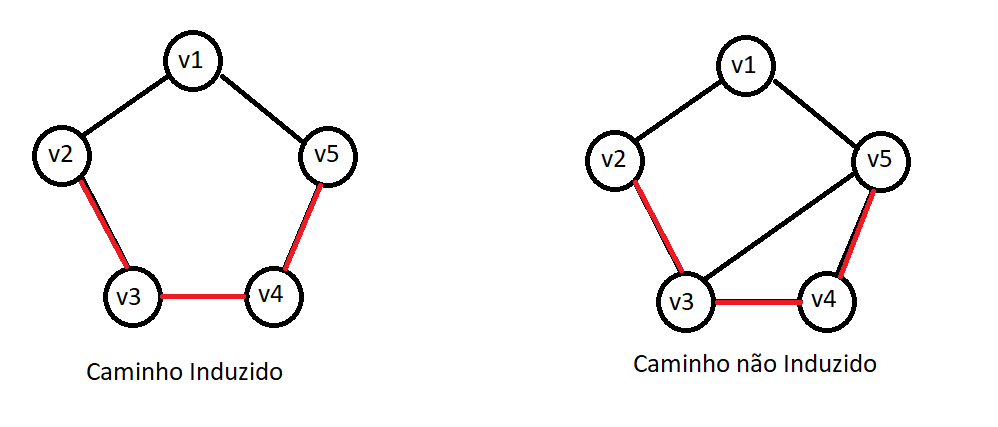


## Comprimento do caminho e comprimento do ciclo
Um caminho de `k` vertices e formado por `k-1` arestas onde o valor de `k-1` e o comprimento do caminho
`v2,v3,v4,v5` e um caminho de comprimento 3

Um ciclo de `k` vertices e formado por `k` arestas onde o valor de `k` e o comprimento do ciclo
`v1,v2,v3,v4,v5,v1` e um ciclo de comprimento 5


## Grafo conexo e grafo desconexo
Um grafo e conexo se todos os vertices estiverem interligados por ao menos uma aresta

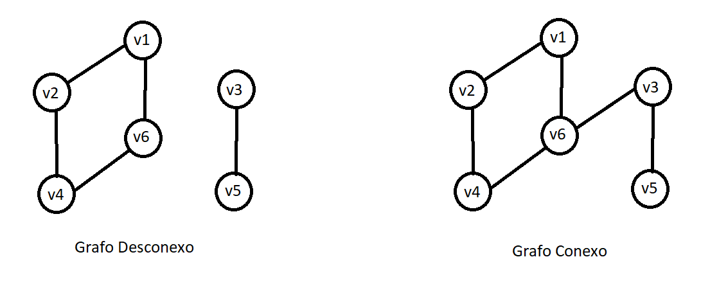

grafo  desconexo - o grafo possui dois vertices que nao se conectam com o resto do grafo
grafo conexo - todos os vertices estao interligados


## Subgrafos
Subgrafos de um grafo e qualquer  grafo `H` tal que `V(G)` contem `V(H)` e `E(G)` contem `E(H)`, ou seja um subgrafo e todo grafo `H` onde os vertices de `H` estejam contidas em `G`

Um subgrafo e dito proprio sequando `V(H) != V(G)` e `E(H) != E(G)`, ou seja  quando somente parte dos vertices e arestas do grafo `G` estao contidas em `H`

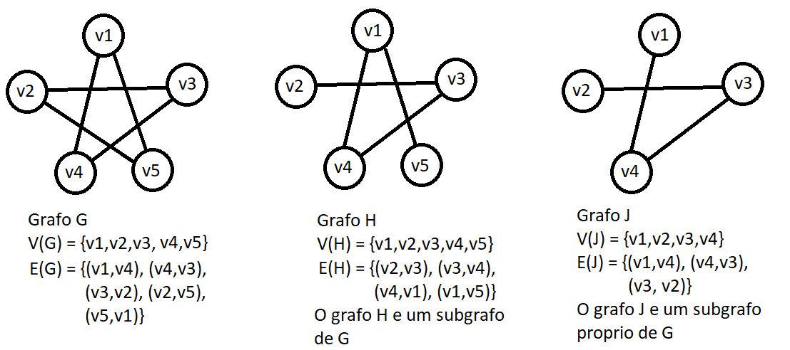


## Componentes
Um subgrafo de `G` e chamado de componente se ao adicionar um novo vertice de `G` no subgrafo ele resulte em um grafo desconexo

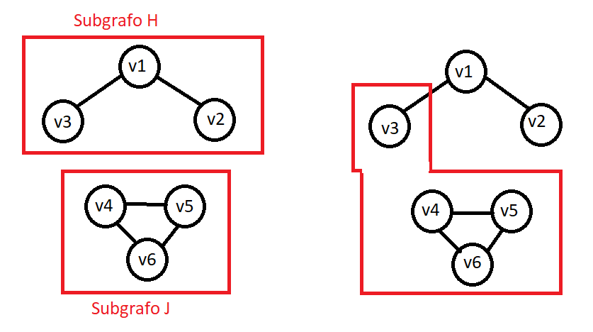

Se adicionarmos no subgrafo `J` o `v3` ele se torna um grafo desconexo. Logo ele e um componente assim como o subgrafo `H` 


## Grafos eulerianos e caminhos eulerianos
um grafo possui um caminho euleriano quando existe um caminho que passa por todas as arestas sem repetir nenhuma

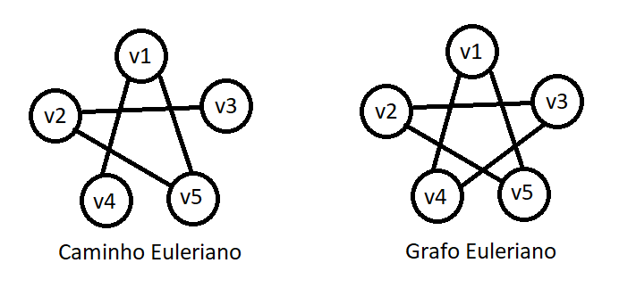

o caminho `v4,v1,v5,v2,v3` e um caminjo euleriano

isso ocorre quando o grafo possio todos os vertices com grau par ou somente se 2 graus possuirem grau impar

Um grafo e euleriano quando possui um ciclo e é possivel passsar por todas as arestas sem repetir.

o segundo grafo a cima e euleriano pois possui um ciclo que passa por todos os vertices sem repetir arestas. isso ocorre quando todos os vertices possuem grau par


## Encontrar ciclos Eulerianos
1. percorremos o circuito `Px` a partir de um vertice qualquer
2. quando encontramos um vertice `V` que pertence a um caminho `Py`, percorremos os vertices de `Py` ate retornarmos a `V`
3. Continuamos percorrendo `Px`


## Grafos Hamiltonianos e Caminhos Hamiltonianos
Um grafo possui um caminho hamiltoniano  se ha um caminho que inclui todos os vertices do grafo uma unica vez

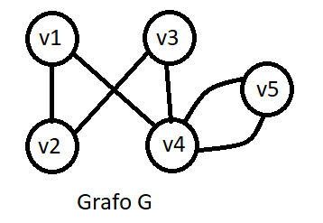

O caminho `v3,v1,v2,v4,v5` é Hamiltoniano

Um grafo é Hamiltoniano se possuir um ciclo que inclui todos os vertices apenas uma vez

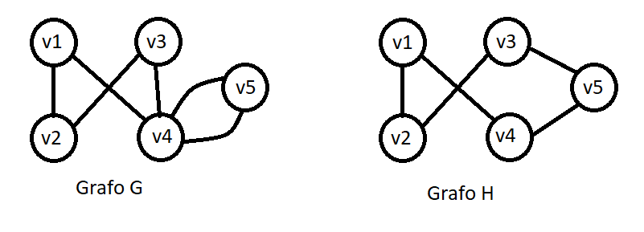

O grafo G nao é Hamiltoniano pois no ciclo o vertice v4 se repete `v3,v1,v2,v4,v5,v4,v3`

O Grafo H é Hamiltoniano pois nenhum vertice se repete `v1,v4,v5,v2,v3,v1`


## Algoritmo de busca em largura
1. seleciona se um vertice `x` de origem (aleatorio)
2. insera o vertice `x` a lista
3. seleciona o ultimo no da lista
4. marque o como visitado
5. insira seus adjacentes na lista
6. retorne ao passo 2 enquanto a lista nao estiver vazia

``` python
Grafo = {'0': [['1',1],['2',2],['3',3]],
         '1': [['4',4]],
         '2': [['4',5]],
         '3': [['4',6]],
         '4': [['5',2]],
         '5': [] }

def busca_largura(G, v_i):
    v=[]
    p=[v_i]

    while p:
        ver=p.pop(0)
        if ver[0] not in v:
            v.append(ver[0])
            for i, j in G[ver[0]]:
                if i not in v:
                    p.append(i)
    print(v)
    return v
```


## Algoritmo de busca em profundidade
1. seleciona se um vertice `x` de origem (aleatorio)
2. insira o vertice `x` na lista
3. selecione o primeiro vertice da lista
4. marque o como visitado
5. insira seus adjacentes a lista
6. retorne ao passo 2 ate que a lista fique vazia

``` python
Grafo = {'0': [['1',1],['2',2],['3',3]],
         '1': [['4',4]],
         '2': [['4',5]],
         '3': [['4',6]],
         '4': [['5',2]],
         '5': [] }

def busca_profundidade(G, v_i):
    v = []
    p = [v_i]

    while p:
        ver = p.pop()
        if ver[0] not in v:
            v.append(ver[0])
            for i,j in G[ver[0]]:
                if i not in v:
                    p.append(i)
    print(v)
    return v
```


## Arvore geradora minima
Uma arvore geradora e um grafo `T` aciclico, conectado e nao direcionado onde suas arestas possuem pesos 
Uma arvore geradora minima e uma arvore geradora onde a soma do total dos pesos das arestas da arvore e a menor possivel

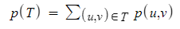


## Aresta Segura
Quando se adiciona uma aresta a arvore `T` esta aresta e chamada de aresta segura para `T`
Deve se sempre seguir a invariante: Antes de cada iteraçao, `T` e um subconjunto de uma arvore geradora minima

Para saber se uma aresta e segura utiliza se a tecnica do corte onde `V` representa o conjunto total de vertices do grafo enquanto `V'` representa o conjunto de vertices pertencentes a arvore logo  `V-V'` representa o conjunto de vertices nao pertencentes a arvore 

se uma aresta possui um vertice no conjunto `V'` e outro vertice no conjunto `V-V'` entao ela cruza o corte
Uma aresta que cruza o corte e chamada de aresta segura 

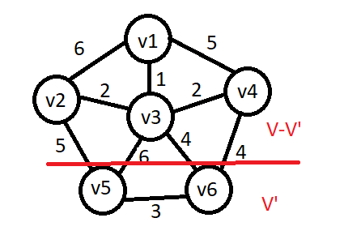


## Aresta Leve 
Uma aresta e dita leve se seu peso for menor entre toda as arestas analizadas.
uma arvore geradora minima usa a aresta mais leve das arestas seguras


## Algoritmo de prim
O algoritmo de prim usa a tecnica do corte para selecionar as arestas modificando o corte a cada passo ate que todos os vertices estejam na arvore

``` python
Grafo = {'0': [['1',1],['2',2],['3',3]],
         '1': [['4',4]],
         '2': [['4',5]],
         '3': [['4',6]],
         '4': [['5',2]],
         '5': [] }

def prim(G, v_i):
    vis = []
    v = v_i
    a = []
    arv = []
    while len(arv)< len(G.keys())-1:
        for adj, peso in G[v]:
            if adj not in vis:
                a.append((v, adj, peso))
        vis.append(v)
        aresta = min(a, key=lambda x: x[2])
        a.pop(a.index(aresta))
        v = aresta[1]
        arv.append(aresta)
    return arv
```


## Algoritmo de Kruskal
O algoritmo de kruskal seleciona sempre oas aresta mais leves de todo o grafo ate formar a arvore geradora minima

```python
Grafo = {'0': [['1',1],['2',2],['3',3]],
         '1': [['4',4]],
         '2': [['4',5]],
         '3': [['4',6]],
         '4': [['5',2]],
         '5': [] }

def kruskal(G):
    arvore = []
    ar = []
    seq = {v: v for v in G.keys()}

    for v, aresta in G.items():
        for a, p in aresta:
            ar.append((v,a,p))
            print((v,a,p))

    ar.sort(key=lambda x: x[2])

    def procurar(ver):
        if seq[ver] != ver:
            seq[ver] = procurar(seq[ver])
        return seq[ver]

    def unir(orig, dest):
        r_orig = procurar(orig)
        r_dest = procurar(dest)
        seq[r_orig] = r_dest

    for orig, dest, peso in ar:
        if procurar(orig) != procurar(dest):
            arvore.append((orig, dest, peso))
            unir(orig, dest)

    return arvore
```


## Ordenaçao topologica
Ordenaçao topologica de um grafo direcionado aciclico e a ordenaçao de todos os seus vertices baseado em suas dependencias
dependencias sao vertices extremos as arestas de entrada do vertice `din(V)`
Muito utilizado para indicar precedencia entre eventos
Algoritmo:

1. seleciona -se um vertice fonte (`din(v) = 0`)
2. marca se este vertice como visitado
3. remove 1 do grau de entrada de todos os vertices adjacentes deste vertice
4. adiciona o ao conjunto
5. retorna ao passo 1 ate todos os vertices serem visitados

```python
Grafo = {'0': [['1',1],['2',2],['3',3]],
         '1': [['4',4]],
         '2': [['4',5]],
         '3': [['4',6]],
         '4': [['5',2]],
         '5': [] }

def kahn(G):
    ordem = []
    fila = []
    dependencias = {v: 0 for v in G.keys()}

    for vertice in G.keys():
        for adjacente, peso in G[vertice]:
            dependencias[adjacente] += 1

    for vertice, dependencia in dependencias.items():
        if dependencia == 0:
            fila.insert(0, vertice)

    while fila:
        vertice = fila.pop()
        for adjacente, peso in G[vertice]:
            dependencias[adjacente] -= 1
            if dependencias[adjacente] == 0:
                fila.insert(0, adjacente)
        ordem.append(vertice)
    if all(vertice in ordem for vertice in G.keys()):
        return ordem
    return None
```


## Algoritmo de dijkstra (menor caminho)
Distancia acumulado e o somatorio dos pesos de todas as arestas entre dois vertices

1. selecione o vertice inicial
2. verifica cada adjacente e atualiza a distancia acumulada de cada um
3. marque o vertice como visitado
4. Selecione o adjacente com a menor distancia acumulada
5. repita o processo

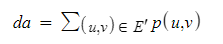

```python
from math import inf

grafo = [
    [0, 2, 3, 0, 6, 0, 0, 0, 0, 0, 4 ],
    [2, 0, 0, 9, 0, 0, 0, 0, 0, 0, 0 ],
    [3, 0, 0, 0, 0, 0, 0, 5, 0, 0, 9 ],
    [0, 9, 0, 0, 0, 6, 0, 0, 0, 0, 0 ],
    [6, 0, 0, 0, 0, 8, 0, 0, 0, 0, 7 ],
    [0, 0, 0, 6, 8, 0, 5, 0, 0, 0, 0 ],
    [0, 0, 0, 0, 0, 5, 0, 3, 11,0, 10],
    [0, 0, 5, 0, 0, 0, 3, 0, 0, 2, 0 ],
    [0, 0, 0, 0, 0, 0, 11,0, 0, 3, 0 ],
    [0, 0, 0, 0, 0, 0, 0, 2, 3, 0, 0 ],
    [4, 0, 9, 0, 7, 0, 10,0, 0, 0, 0 ]
]

def menor_caminho(G, o, d):
    d_ac = [inf for v in range(len(G))]
    ant = list(range(len(G)))
    exp = [False] * len(G)

    d_ac[o] = 0
    cam = []

    ver = o
    while not all(exp):
        exp[ver]=True
        for adj, p in enumerate(G[ver]):
            if not exp[adj] and p != 0:
                if d_ac[ver] + p < d_ac[adj]:
                    d_ac[adj] = d_ac[ver] + p
                    ant[adj] = ver
        ver = min(enumerate(d_ac),
            key=lambda x: x[1] if not exp[x[0]] else inf)[0]

    ver = d
    while ant[ver] != ver:
        cam.insert(0, ver)
        ver = ant[ver]

    cam.insert(0, o)

    return cam, d_ac[d]
```